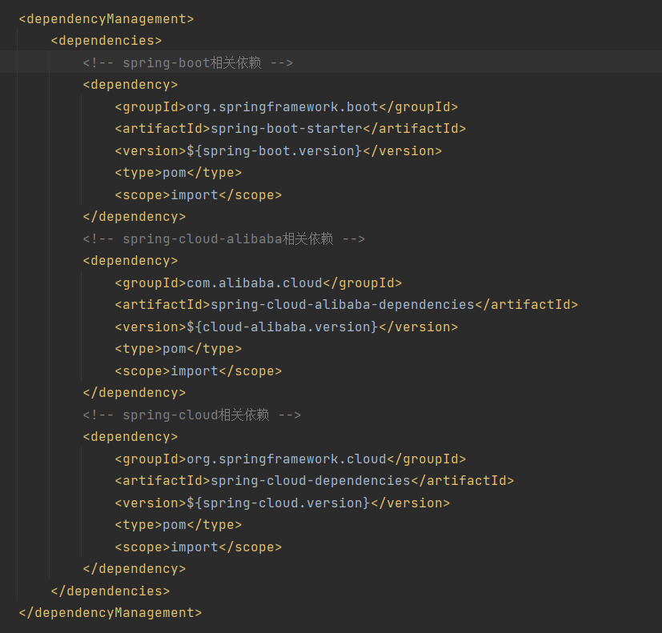
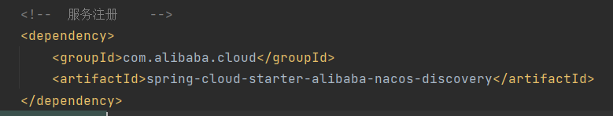
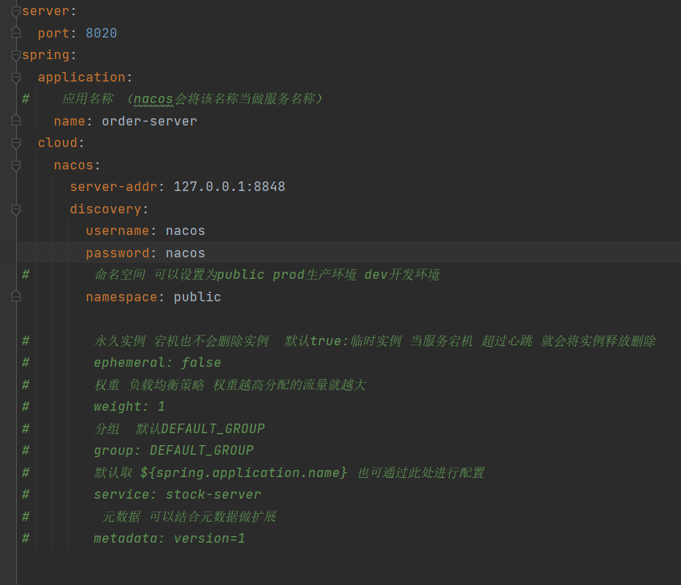
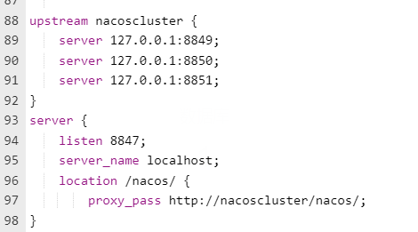

# spring-cloud-alibaba学习笔记

## 基础项目搭建
1. 使用spring构造器创建一个spring-boot项目
2. 添加model使用maven方式
3. 父pom文件中引入spring-cloud-alibaba相关依赖
   + 需要在dependencyManagementn标签内引入以下基础依赖
   
   + 项目相关版本访问github搜索spring-cloud-alibaba查看
   
这样一个基础的spring-cloud-alibaba项目搭建好了

----

## 项目集成服务注册 
1. 先去github下载nacos对应项目搭建时所需要的版本
2. 解压后如需要单机运行，则修改/bin/startup文件
   + set MODE = "xxxx" 为运行模式
   + standalone 为 单机运行
   + cluster 为集群模式
3. 子项目添加nacos 服务注册依赖
   + 此处不需要标注版本号，因为我们在父pom中引入spring-cloud-alibaba里面有维护我们所需依赖的版本
   
4. 子项目配置文件中添加配置
   + 应用名称: nacos默认将${spring.applicaiton.name}当做应用名也可在${spring.cloud.nacos.service}中进行配置
   + ${server-addr} nacos的服务地址
   + ${discovery.username} nacos的登录名
   + ${discovery.password} nacos的登录密码
   + ${discovery.namespace} nacos命名空间 例如：public prod dev
   + ${discovery.weight} 权重,使用负载均衡策略,权重越高分配的流量就越大
   + ${discovery.group} 分组, 默认DEFAILT_GROUP
   + ${discovery.metadata} 元数据,可以结合元数据做扩展,需要进行源码修改--课程上这么说的还没深入研究
   + ${discovery.ephemeral} 实例 默认为true临时实例 false为永久实例 简单理解为当为false时哪怕服务挂掉了宕机了也不会删除nacos中服务列表中的服务
   + ${discovery.cluster-name} 集群名称 默认为DEFAULT 单集群没必要用 多集群时使用
   

----

##nacos功能
   1. 配置管理：顾名思义就是管理相关配置
   2. 服务列表：我们启动的服务将会被注册到nacos 在服务列表中显示
      + 保护阈值：0-1 例如：当前服务有两个实例，宕机一个实例，设置的保护阈值为0.5  (健康实例/总实例)的值小于或等于保护阈值 为应对洪峰流量 我们宕机的这个服务也会被请求到
      + 权重：权重越大分配的流量就越大
   3. 集群管理：以集群启动的都会在这里展现
   4. 其他的就不写了，比较简单没啥营养，我也比较懒
   
----

## nacos 其他问题
1. nacos运行后会在bin目录生成logs文件夹，logs文件夹内会有访问记录的log
2. nacos通过心跳检测来判断当前服务是否在线，心跳时间为10秒钟一次

## nacos集群搭建--伪集群
1. 服务器环境准备
   + 安装mysql
   + 安装nginx

2. 创建数据库并运行sql文件
   + 文件位置：/conf/nacos-mysql.sql
3. 下载对应nacos压缩包分别进行解压
4. 修改application.properties文件
   + 修改端口
   + 取消mysql注释
5. 修改cluster.conf文件中集群地址
6. 如服务器内存过小则修改startup.sh中内存
7. 配置nginx反向代理作为负载均衡

还可以用docker搭建集群,更加简单,抽空试一下

----

## ribbon 负载均衡
1. 负载均衡
   + 硬件负载均衡-如交换机类似
   + 软件负载均衡
     + 代码实现负载均衡
     + nginx负载均衡
2. 软件负载均衡
   + 客户端负载均衡
   + 服务端负载均衡 例如nginx
3. 常见负载均衡算法
   + 随机：通过随机选择服务进行执行
   + 轮询：负载均衡默认实现方式,请求发送过来以后排队处理
   + 加权轮询：通过对服务器性能的分析,给高配置,低负载的服务器分配更高的权重,均衡各服务器压力
   + 地址Hash：通过客户端请求地址的HASH值去模型映射进行服务器调度。ip->hash
   + 最小连接数：即使请求均衡了,压力也不一定均衡,最小连接数法就是根据服务器的情况,比如请求积压数等参数,将请求分配到当前压力最小的服务器上。最小活跃数
4. nacos使用ribbon
   + nacos默认使用的就是ribbon  --nacos-discobery依赖中默认存在ribbon
   + 添加LoadBalanced注解就可使用
5. ribbon常用负载均衡策略
   + IRule 所有负载均衡策略的父接口
   + AbstractLoadBalancerRule 抽象类,里面定义了一个ILoadBalancer,就是负载均衡器
   + RandomRule 随机选择服务器实例
   + RoundRobinRule 轮询
   + RetryRule  轮询基础上进行重试
   + WeightedResponseTimeRule 权重,会根据每一个实例的运行情况来计算该实例的权重,然后挑选实例的时候根据权重进行挑选,根据平均相应时间来计算权重,响应时间越短,服务实例权重越大
   + ClientConfigEnabledRoundRobinRule 和RoundRobinRule轮询策略一致
   + BestAvailableRule 过滤失效的服务实例,顺便找出并发请求最小的服务实例来调用
   + ZoneAvoidanceRule 默认规则 符合判断server所在区域的性能和server的可用性选择服务器
   + NacosRule nacos扩展了一个基于配置的权重扩容